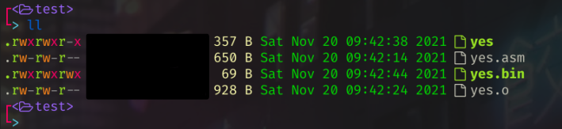

# Why use Assembly:
I wanted to start this second part with why some people like me still choose to use Assembly, when in the modern day we have access to C, Rust, Python, Java all of these modern languages with much more understandable syntax's. 

The simple reason is that a good programming language never dies and Assembly has it's places. For example most low level code such as x86(Legacy MBRs), Machine specific Instructions, or embedded development where resources are limited.

The simple reason why ASM is still used in all these places is simple and that's no language is really a good substitute for ASM here. As modern languages are typically defined with portability in mind, meaning you can cross-compile your C program you made on x86 on to an ARM architecture processor and run it with little to no issues. The reason for this design choice is that it allows high level code to be written once and run on multiple architectures. So C for example(assuming you don't use inline Assembly) doesn't use any machine specific instructions meaning that while the outputted opcodes are different they can be represented on both architectures.

Whereas Assembly must be written for each individual architecture you wish to run it on but it will also give you a much greater deal of control over your outputted code, which in turn can allow you to be much more efficient in your programming. Also allowing you to achieve things you could not do in Just C.

# Where not to use Assembly

Example:
I have previously recoded GNU's coreutils yes program out a sense of curiosity to see how small I can make it. Below is an image that shows how small I manged to get the program before I eventually gave up on it.

as you can see I managed to reduce the size all the way down to 357 bytes with ELF headers
and a measly 69 bytes when you remove all of the ELF data structures. This helps at the time of writing a `LS`
command on my shows yes as being `67664 bytes` in size. 

So why don't we all use Assembly if it's so great, well it's not that simple my example was written in X86_64 bit Assembly
and while the 69 bytes figure is really cool it's worth noting a few caveats to it. 

- It won't work on 32bit or 16bit x86 PCs that would require the code to be rewritten for those platforms
- it won't work on ARM, RISC-V or any other computer architecture not without a rewrite.
- Yes I got down to 69 bytes but that took me a lot of tinkering with Assembly
- The code is not as easy to read so should a bug or exploit be found it will be harder to find and track down.

This yes program is an example of where not to use Assembly for programming as it's a high level program intended to be used on lots of different systems and where this code is so low level there is no guaranteed that something won't go wrong with it, when used in a different environment than where I tested it.

But it also serves as a great example of why Assembly is used in certain situations where resources are limited as you can be incredibly efficient in your implementations.

# So a good place to use Assembly:

Well as I said before Assembly is a low level language and should be used in cases like OS-Dev, Bootloader dev, Driver Development, Embedded software dev, Firmware development and other low level fields.

This is because in these fields you are working with the hardware on such a close level that having access to C or another language isn't always guaranteed. Or even preferred as for example in a MBR boot program you need to call lots of machine specific instructions and are limited to 512 bytes not a good field for C yes you could use it but it won't work as well.

# Should you use Assembly:
Almost certainly not. However it depends on what you doing, if you are working on something low level it may be worth asking is it time to dip into Assembly or can I get way with C? As the ideal way to write this would be to do the parts you can do in C in C and then the parts that need Assembly in Assembly, as this will allow your project a great deal of portability. For example this is why Linux is mostly written in C. This way the kernel doesn't have to be rewritten for each CPU architecture rather just the lowest level bits written in Assembly need to be redone.

# Final Notes:
I know this was a short one from me but what I am hoping to illustrate here is just because you know Assembly and it's "Technically" more byte efficient when used well. Does not mean you should use it for everything. As it can be much harder to understand and debug. It can easily because less byte efficient than C if it's used poorly or in a inefficient manner and if your program is something you want to run on all of these different platforms maybe best to just stick to something more high level. Otherwise you will have to maintain a separate code base for each platform and that will become a debugging nightmare when bugs appear on one platform but not that the other.

Thank you for reading... Till next time Cat <3
